# 审查室数据流图

> 本文档用流程图+文件对照表，清楚说明审查室每个步骤的数据来源、处理逻辑和输出目的地。
> 最后更新: 2026-07-10

---

## 一、总览流程图

```mermaid
flowchart TB
    subgraph 输入层["📥 输入层（数据源）"]
        A1["📄 chapters/chapter_XXX.md<br/>章节正文"]
        A2["⚙️ config/anti_slop_rules.yaml<br/>S1正则规则库"]
        A3["📐 config/review_dimensions.yaml<br/>13维度定义+子项+阈值"]
        A4["⚙️ config/default_config.yaml<br/>质量门禁阈值+审查权重"]
        A5["🧠 story_state.json<br/>世界树/角色/情节线程"]
        A6["🔑 用户设置 (DB.config)<br/>供应商/模型/温度/角色参数"]
    end

    subgraph 处理层["⚙️ 处理层（审查流水线）"]
        B1["🔍 S1 机械闸<br/>正则扫描19条规则<br/>连续性引擎检查"]
        B2["🔴 S2 严审官<br/>LLM调用 temperature=0.3<br/>13维度评分+建议"]
        B3["🟡 S2 衡审官<br/>LLM调用 temperature=0.3<br/>13维度评分+建议"]
        B4["🟢 S2 宽审官<br/>LLM调用 temperature=0.4<br/>13维度评分+建议"]
        B5["📮 选票汇总 Ballot<br/>聚合3审建议→去重"]
        B6["🔬 夹逼优选 SqueezeSelector<br/>计算每条建议3D坐标<br/>选出质量分最高的"]
        B7["🗳️ 投票确认 Voter<br/>(置信度<85%时触发)"]
        B8["🚪 质量门禁 QualityGate<br/>分数 vs 阈值判定"]
    end

    subgraph 输出层["📤 输出层（磁盘持久化）"]
        C1["📄 chapters/chapter_XXX.md<br/>正式章节（只读基准）"]
        C2["📝 drafts/revised_第XXX章_v{N}.md<br/>修改草稿（版本化保存）"]
        C3["🔍 reviews/review_XXX.json<br/>审查记录"]
        C4["📚 projectLog/revision_history.json<br/>版本历史"]
        C5["🧠 内存 p._reviewHistory<br/>项目审查历史缓存"]
    end

    subgraph 展示层["🖥️ 展示层（用户界面）"]
        D1["📝 章节编辑器 textarea<br/>实时编辑内容"]
        D2["💡 建议卡片列表<br/>展开→查看原文/修改/理由<br/>点击「应用」替换编辑器"]
        D3["📊 三审评分栏<br/>🔴严审 🟡衡审 🟢宽审<br/>加权总分+门禁判定"]
        D4["📚 版本历史折叠面板<br/>草稿记录+审查记录"]
        D5["⚙️ S1结果折叠面板<br/>违规项+原文片段"]
    end

    %% 数据流向
    A1 --> B1
    A2 --> B1
    A5 -.->|"可选"| B1
    A4 --> B8
    
    A1 --> B2 & B3 & B4
    A3 --> B2 & B3 & B4
    A6 --> B2 & B3 & B4
    
    B1 --> B5
    B2 & B3 & B4 --> B5
    B5 --> B6
    B6 --> B7
    B7 --> B8
    
    B1 --> C3
    B2 & B3 & B4 --> C3
    B5 --> C3
    B6 --> C3
    B7 --> C3
    B8 --> C3
    
    C1 -->|"读取原始内容"| D1
    C2 -->|"读取最新草稿"| D1
    D1 -->|"💾保存草稿"| C2
    D1 -->|"✅定稿"| C1
    
    C3 --> D3 & D5
    D2 -.->|"📌应用建议"| D1
    C4 --> D4
    C5 --> D4

    style 输入层 fill:#1a1a3a,stroke:#8888aa
    style 处理层 fill:#1a3a1a,stroke:#2ed573
    style 输出层 fill:#3a1a1a,stroke:#e94560
    style 展示层 fill:#1a2a3a,stroke:#00d4ff
```



---

## 二、逐步骤数据源详解

### Step 1: S1 机械闸

| 项目 | 内容 |
|------|------|
| **输入** | `chapters/chapter_XXX.md`（章节正文） |
| **规则来源** | 代码内嵌 19 条规则（基于 `anti_slop_rules.yaml` 完整实现） |
| **可选输入** | `story_state.json`（连续性引擎：检查角色缺席/伏笔超期等） |
| **处理逻辑** | 纯正则匹配 + 统计分析（段落均匀度/句子长度方差等） |
| **输出** | 违规列表（每项含：规则名、严重度 BLOCK/WARN、原文片段、说明） |
| **保存到** | `reviews/review_XXX.json` 的 `s1Results` 字段 |

### Step 2-4: S2 三审查官

| 项目 | 严审官 (Strict) | 衡审官 (Moderate) | 宽审官 (Lenient) |
|------|-----------------|-------------------|-----------------|
| **角色定位** | 资深文学评论家 | 资深编辑 | 读者代表 |
| **温度** | 0.3 | 0.3 | 0.4 |
| **触发阈值** | 维度分 < 8 即标记 | 维度分 < 6 即标记 | 维度分 < 4 即标记 |
| **检查粒度** | exhaustive（全部子项） | standard（核心子项） | overview（大局） |
| **建议风格** | 激进的大幅修改 | 实用的局部修改 | 最小修改 |
| **权重** | 1.0 | 0.7 | 0.4 |

**输入来源：**
- 章节正文（`chapters/chapter_XXX.md`）
- 13 维度定义+子项（来自 `review_dimensions.yaml`）
- 用户设置中的温度/模型参数

**输出结构（每个审查官）：**
```json
{
  "score": 0-100,          // 综合评分
  "scores": [1-10×13],     // 13个维度的逐项评分
  "comment": "简短评语",
  "suggestions": [         // 修改建议列表
    {
      "type": "rewrite|polish",
      "location": "原文位置",
      "current_text": "原文片段",
      "proposed_change": "修改方案",
      "reasoning": "修改理由",
      "expected_improvement": {"dimension": "维度", "delta": "+N"}
    }
  ]
}
```

### Step 5: 选票汇总 (Ballot)

| 项目 | 内容 |
|------|------|
| **输入** | 3 个审查官的 `suggestions[]` 数组 |
| **处理逻辑** | 合并→按相同审查官+维度去重→统计每条建议的严重度 |
| **输出去重规则** | 相同 `reviewer + dimension + proposed_change前30字` 视为重复 |
| **输出** | 去重后的建议列表 |

### Step 6: 夹逼优选 (SqueezeSelector)

| 项目 | 内容 |
|------|------|
| **输入** | 去重后的建议列表 + 3 个审查官的完整审查数据 |
| **核心算法** | 对每条建议计算 3D 坐标（U=严审认可度, M=衡审, L=宽审） |
| **计算公式** | 宽度 w=\|U-L\|, 收敛度 c=1/(1+w), 中心 bc=(U+L)/2, 对齐度 a=1-\|M-bc\|, 质量 q=c×a |
| **输出** | 质量分最高的建议 + 备选建议 + 置信度 + 数学证明 |

### Step 7: 投票确认 (Voter)

| 项目 | 内容 |
|------|------|
| **触发条件** | 夹逼置信度 < 85% 且有备选建议 |
| **输入** | 最优建议 vs 备选建议 |
| **处理** | 调用 LLM（temperature=0.2）做最终裁决 |
| **输出** | 选中的建议（A 或 B）+ 置信度 + 理由 |

### Step 8: 质量门禁 (QualityGate)

| 项目 | 内容 |
|------|------|
| **输入** | 加权总分 + 严审最低维度分检查结果 |
| **配置来源** | `default_config.yaml` 的 `quality_gate` 段 |
| **判定规则** | 见下方表格 |
| **输出** | pass / revise / manual |

**阈值来源：**

| 参数 | 默认值 | 配置路径 | 说明 |
|------|--------|---------|------|
| passThreshold | 75 | 设置页→质量门禁→通过阈值 | ≥此分自动通过 |
| reviseThreshold | 50 | 设置页→质量门禁→修订阈值 | ≥此分需修订 |
| maxIterations | 3 | 设置页→质量门禁→最大迭代 | 最多修订次数 |
| strictMinDim | 5 | 设置页→质量门禁→严审最低维度分 | 严审任何维度低于此分→人工 |

---

## 三、文件存储对照表

| 文件路径 | 用途 | 读写时机 | 版本化? |
|----------|------|---------|---------|
| `projects/{项目}/chapters/chapter_001.md` | 正式章节文件（只读基准） | 读：审查时加载；写：定稿时覆盖 | ❌ 覆盖 |
| `projects/{项目}/drafts/revised_第001章_v1.md` | 修改草稿 | 写：每次点击「保存草稿」 | ✅ v1/v2/v3… |
| `projects/{项目}/reviews/review_第001章_2026-07-10.json` | 审查完整记录 | 写：审查完成时 | ✅ 时间戳 |
| `projects/{项目}/projectLog/revision_history.json` | 版本历史索引 | 读：展示历史列表；写：保存草稿+定稿时 | ❌ 追加 |
| `projects/{项目}/project.json` | 项目元数据 | 读：加载项目；写：更新章节状态 | ❌ 覆盖 |
| `config/anti_slop_rules.yaml` | S1 规则定义（只增不删） | 读：S1初始化时加载 | — |
| `config/review_dimensions.yaml` | 13维度+审查官配置 | 读：S2审查官初始化时，动态拼接提示词 | — |
| `config/default_config.yaml` | 全局默认配置 | 读：启动时加载，用户设置覆盖 | — |

---

## 四、关键设计原则

### 4.1 数据流向原则
```
用户编辑 → 内存(编辑器) → 💾保存草稿 → 磁盘(drafts/)
                                        ↓
                                    ✅定稿 → 磁盘(chapters/) → 只读基准
```

### 4.2 版本化原则
- **正式章节**（`chapters/`）— 只读，定稿时覆盖
- **修改草稿**（`drafts/`）— 追加，版本号递增，永不删除
- **审查记录**（`reviews/`）— 时间戳命名，每次审查独立文件

### 4.3 配置优先级
```
代码内嵌默认值 < config/default_config.yaml < 用户设置(DB.config)
```

---

## 五、数据流中的关键函数调用

```
renderers.review()
  ├── onReviewChChange()          切换章节
  │     ├── loadReviewChapterContent()  读取磁盘最新内容
  │     └── renderers.review()         重渲染
  │
  ├── startReview(chNum)          启动审查
  │     ├── runS1Gate(content)          S1机械闸
  │     ├── callReviewer(...)×3        三审查官（串行）
  │     ├── computeSqueeze(...)        夹逼优选
  │     ├── calculateWeightedScore()   加权评分
  │     └── qualityGateDecision()      门禁判定
  │
  ├── applyReviewSuggestion()     应用单条建议到编辑器
  │
  ├── saveReviewDraft()           保存草稿到磁盘
  │     └── saveFileToDisk()           drafts/revised_XXX_vN.md
  │
  └── approveChapter()            定稿
        └── saveFileToDisk()           chapters/chapter_XXX.md
```
